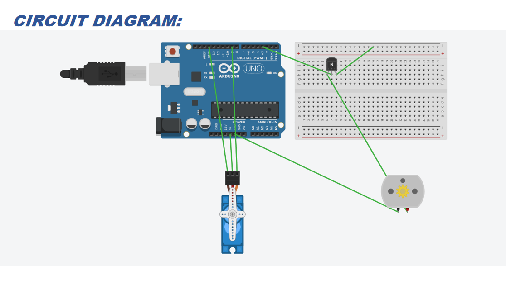
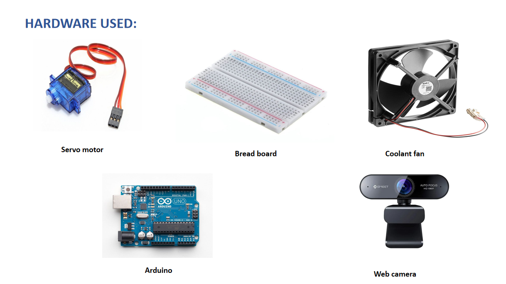

## Project Overview
This project demonstrates a system that allows users to control a fan using hand gestures without physically touching any switches. It uses computer vision techniques to detect hand gestures through a camera and performs actions like turning the fan ON/OFF.

---

## Features
- Real-time hand gesture detection
- Contactless fan control
- User-friendly system
- Can be extended for smart home automation

---

## Technologies Used
- Python
- OpenCV
- NumPy
- (Add Arduino if used)

---
## Circuit Design

## Hardware Used

##  Project Structure
- hardware used.png – Components used in the project  
- circuit design.png – Circuit diagram  
- `working
